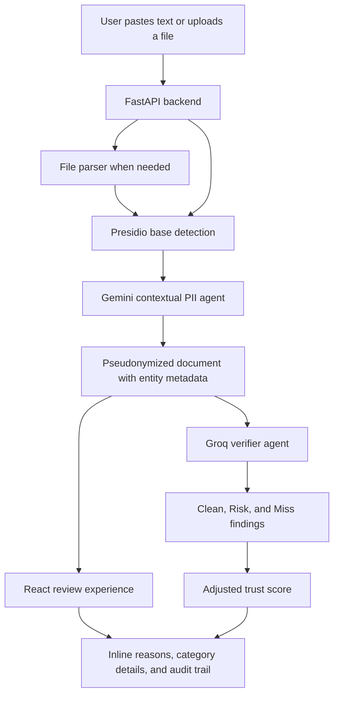

# Glass Box

[](https://glass-box-ecru.vercel.app)
[](https://glass-box-api.onrender.com/health)


Glass Box is a trust-focused PII pseudonymization tool. It lets a user paste or upload a sensitive document, replaces personally identifiable information with readable labels, and explains every decision in plain English.

The project was built for a skeptical user who does not want to take privacy tooling on faith. Instead of only showing black bars or a final score, Glass Box shows what was hidden, why it was hidden, what stayed visible, and what a second verifier found after the first pass.

## Application

Hosted site: https://glass-box-ecru.vercel.app  
Backend API: https://glass-box-api.onrender.com  
Health check: https://glass-box-api.onrender.com/health  
Demo video: https://drive.google.com/file/d/1dnZj7U2NPvII701Ju34FL46D82XosZdZ/view?usp=sharing

To run locally, start the FastAPI backend on port `8000`, then start the Vite frontend on port `5173`. Full instructions are below.

## What It Does

- Detects sensitive information in pasted text or uploaded files.
- Replaces PII with stable labels like `[FULL_NAME_1]`, `[EMAIL_1]`, and `[ADDRESS_1]`.
- Shows clickable inline labels with original value, type, confidence, and reason.
- Provides a trust summary with category counts and detailed per-category findings.
- Runs an independent verifier that checks for missed PII and residual re-identification risk.
- Explains verification outcomes such as Clean, Risk, and Miss.
- Maintains an audit trail so the user can inspect what happened step by step.

## Why It Exists

The prompt centers on Marcus, a worried user with a sensitive document. His core question is: why this, and why not that?

Glass Box answers that question through transparency:

- Hidden items are not just hidden. They are labeled and explained.
- Visible text is acknowledged instead of ignored.
- Verification is separate from detection, so the tool has a second pass that can disagree with the first.
- The score is treated as a review signal, not a magic number.

## Architecture



## Tech Stack

- Dataset exploration: ai4privacy/pii-masking-43k
- Frontend: React 19, Vite, Tailwind CSS
- Backend: FastAPI, Pydantic, Uvicorn
- PII base pass: Microsoft Presidio
- Contextual detection: Gemini
- Verification pass: Groq
- Deployment: Vercel for frontend, Render for backend

## Local Setup

The hosted site is available above. Use the steps below only if you want to run the full-stack app locally.

### 1. Install backend dependencies

```bash
pip install -r requirements.txt
```

### 2. Configure environment variables

Copy `.env.example` to `.env` and add your keys:

```bash
LLM_PROVIDER=gemini
GEMINI_API_KEY=your_gemini_api_key_here
GROQ_API_KEY=your_groq_api_key_here
```

### 3. Run the backend

```bash
python -m uvicorn backend.main:app --host 127.0.0.1 --port 8000
```

### 4. Install frontend dependencies

```bash
cd frontend
npm install
```

### 5. Run the frontend

```bash
npm run dev
```

Open `http://127.0.0.1:5173`.

## Production Configuration

The frontend reads the backend URL from:

```bash
VITE_API_BASE_URL=https://glass-box-api.onrender.com
```

The backend accepts deployed frontend origins through:

```bash
FRONTEND_ORIGIN_REGEX=https://.*\.vercel\.app
```

Render configuration is in `render.yaml`. Vercel configuration is in `frontend/vercel.json`.

## API Overview

### `POST /pseudonymize`

Processes raw text and returns pseudonymized text, entity details, a trust score, category counts, and a summary.

### `POST /pseudonymize/upload`

Processes uploaded files such as PDF, TXT, JSON, CSV, and DOCX.

### `POST /verify`

Runs the independent verifier against pseudonymized text and returns findings plus an adjusted trust score.

### `GET /demo-documents`

Returns built-in demo documents for finance, healthcare, and general business.

### `GET /health`

Returns backend health status.

## Verification

Useful local checks:

```bash
python scripts/explore_dataset.py
cd frontend
npm run lint
npm run build
```

## Design Priorities

The UI is intentionally direct and inspection-first. The goal is not to impress the user with a black-box AI result. The goal is to let them interrogate the result quickly:

- What was detected?
- Why was it flagged?
- What confidence did the system have?
- What did the second verifier challenge?
- What remains visible and why?

That is the heart of the product.
